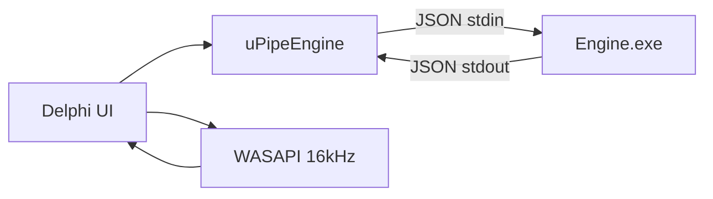

# SmartInterview

**Copilota AI locale per colloqui tecnici su Windows.**

SmartInterview cattura l'audio di sistema (e opzionalmente il microfono), lo trascrive in locale con **Whisper**, e genera risposte in streaming da un modello **Qwen2.5** (GGUF) — tutto **senza API cloud** durante il colloquio.

| Stack | Tecnologia |
|-------|------------|
| Interfaccia | Delphi 12 VCL (Win64) |
| Motore AI | .NET 10 subprocess (`SmartInterview.Engine.exe`) |
| Speech-to-text | Whisper.net |
| LLM | LLamaSharp / llama.cpp (CUDA12, Vulkan, CPU) |

---

## Documentazione

| Documento | Contenuto |
|-----------|-----------|
| [Architettura](docs/architecture.md) | Diagrammi, flussi, modalità ascolto, GPU backends |
| [Setup e build](docs/setup.md) | Requisiti, compilazione, prima esecuzione, troubleshooting |
| [Riferimento unità Pascal](docs/pas-reference.md) | Descrizione di ogni file `.pas` |
| [Motore C# / IPC](docs/csharp-engine.md) | Subprocesso Engine, protocollo JSON, moduli .cs |
| [Sistema licenze](docs/licensing.md) | Codec v4, attivazione, LicenseManager |
| [Unità condivise Common](Common/README.md) | Convenzioni per `.pas` multi-progetto |

---

## Struttura repository

```
SmartInterview_Delphi/
├── Projects.groupproj              # Group project (SmartInterview + LicenseManager)
├── Projects/
│   ├── SmartInterview/             # Applicazione principale
│   │   ├── SmartInterview.dpr/.dproj
│   │   ├── uMainForm.*             # Overlay colloquio
│   │   ├── uFrm*.pas               # Form (licenza, splash, settings, …)
│   │   └── src/                    # Unità Delphi (audio, IPC, settings)
│   └── LicenseManager/             # Tool generazione licenze
├── Common/                         # Unità Pascal condivise (es. uLicenseCodec)
├── Engine/                         # Motore C# + IPC
│   ├── Program.cs
│   ├── SmartInterview.Engine.csproj
│   └── *.cs
├── docs/                           # Documentazione dettagliata
└── README.md                       # Questo file
```

---

## Come funziona (in breve)



1. **Avvio** — verifica licenza, disclaimer, splash con download/caricamento modelli.
2. **Ascolto** — manuale (tieni Ctrl/Shift/Alt) o automatico (VAD su audio di sistema).
3. **Trascrizione** — PCM inviato all'engine via IPC `transcribe` / `transcribe_stream`.
4. **Risposta** — LLM locale in streaming (`generate_stream`); in modalità auto, `classify_utterance` filtra le non-domande.

L'engine richiede un **token di sessione** valido (derivato dalla licenza) passato via variabili d'ambiente. Dettagli in [Architettura → Autenticazione sessione](docs/architecture.md#autenticazione-sessione-engine).

---

## Modelli AI

I modelli **non** sono nel repository. Al primo avvio vengono scaricati in `<exe>\models` o `%LOCALAPPDATA%\SmartInterview\models`.

| Tier | LLM | Whisper |
|------|-----|---------|
| Fast | Qwen2.5-3B Q4_K_M | ggml-small |
| Balanced | Qwen2.5-7B | ggml-medium |
| Max | Qwen2.5-14B | ggml-large-v3 |

Il tier viene scelto in base alla GPU/VRAM rilevata (`HardwareProbe` + impostazioni utente).

### Backend GPU

| GPU | Ordine preferenza LLM |
|-----|----------------------|
| NVIDIA (non-Blackwell) | CUDA12 → Vulkan → CPU |
| NVIDIA Blackwell (RTX 50xx) | Vulkan → CPU |
| Altro | Vulkan → CPU |

---

## Build rapida

**Requisiti:** RAD Studio 12+ (Delphi Win64), .NET SDK 10, Windows x64.

1. Apri `Projects.groupproj` in RAD Studio.
2. Compila **SmartInterview** (Win64).
3. L'engine viene buildato e deployato automaticamente in `Projects/SmartInterview/Win64/<Config>/EngineDeploy/`.

Build manuale engine:

```powershell
dotnet build Engine\SmartInterview.Engine.csproj -c Release
```

Guida completa: [docs/setup.md](docs/setup.md).

---

## Progetti Delphi

| Progetto | Scopo | Output |
|----------|-------|--------|
| **SmartInterview** | App colloquio | `Projects/SmartInterview/Win64/Release/SmartInterview.exe` |
| **LicenseManager** | Tool licenze (interno) | `Projects/LicenseManager/Win64/Release/LicenseManager.exe` |

Entrambi risolvono le unità condivise da `Common/` (search path `..\..\Common\`).

---

## Impostazioni utente

Salvate nel registry (`uRegistryStore.pas`):

- Lingua (default `en`)
- Tier modelli LLM e Whisper
- Lunghezza risposta (breve/medio/lungo)
- Tasto ascolto (Ctrl/Shift/Alt)
- Opacità overlay
- Profilo colloquio (ruolo, stack, job, esperienza)
- Parametri VAD (soglia, silenzio)

---

## Note per manutentori

- **Engine discovery:** `<exe>\EngineDeploy\SmartInterview.Engine.exe` per primo (`uPipeEngine.FindEngineExe`).
- **Memoria conversazione:** RAM in `LocalLlmClient.cs`; baseline tokens esclusi dalla % contesto UI.
- **Manuale vs auto:** la cattura manuale risponde sempre; l'auto usa `classify_utterance` + marker `[[SKIP]]`.
- **Nuovo comando IPC:** handler in `Engine/Program.cs` → wrapper `uPipeEngine.pas` → caller `uMainForm.pas`.
- **Unità condivise:** mettere in `Common/`, non duplicare tra progetti.
- **Diagnostica trascrizione:** `%LOCALAPPDATA%\SmartInterview\live-transcribe-diag.log`.

---

## Licenza software

SmartInterview richiede una chiave licenza valida all'avvio. Per generare chiavi usare **LicenseManager** (tool interno). Vedi [docs/licensing.md](docs/licensing.md).
