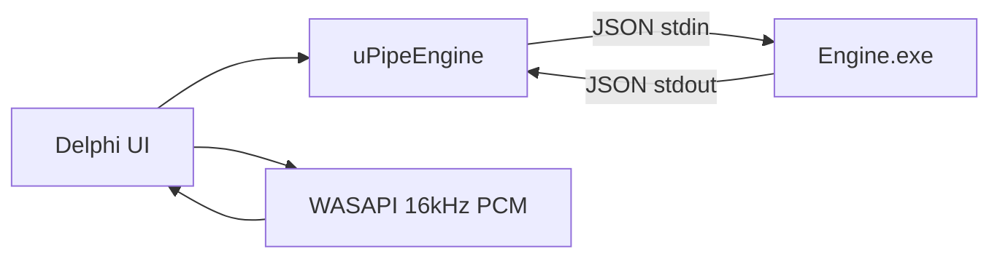

# SmartInterview (Delphi)

Windows desktop copilot for live technical interviews. Captures system audio (optional mic), transcribes locally with Whisper, streams answers from a local Qwen2.5 GGUF model. No cloud API during interviews.

**Stack:** Delphi 12 VCL (Win64) + .NET 10 subprocess (`SmartInterview.Engine.exe`) for Whisper.net and LLamaSharp.

---

## Layout

```
SmartInterview_Delphi/
├── SmartInterview.dpr / .dproj   # Delphi entry + project
├── uMainForm.* / uFrm*.*           # UI forms
├── src/                            # Delphi units (audio, IPC, settings, licensing)
├── Engine/                         # C# subprocess + shared engine logic
│   ├── Program.cs                  # JSON-lines IPC host
│   ├── SmartInterview.Engine.csproj
│   └── *.cs                        # Whisper, LLM, downloads, GPU probe
├── Resources/app.ico
├── README.md
└── .gitignore
```

| Layer | Role |
|-------|------|
| Delphi UI | WASAPI capture, hotkeys, overlay, tray, read-along |
| `src/uPipeEngine.pas` | Spawns engine, JSON stdin/stdout IPC |
| `Engine/Program.cs` | Command dispatcher |
| `Engine/*.cs` | Models, transcription, LLM, GPU backends |

Models are not in the repo. First run downloads to `<exe>\models` or `%LOCALAPPDATA%\SmartInterview\models`.

---

## Startup flow

1. **Single-instance mutex** → license → disclaimer → optional interview setup.
2. **Splash** (`uAppStartup.RunInitialStartup`):
   - Start `SmartInterview.Engine.exe` from `Win64\*\EngineDeploy\` (created by engine build).
   - `ping` → `startup` IPC: download/load Whisper + LLM, warm-up, apply profile.
3. **Main form** reuses the engine from splash.

### Engine license handshake

`SmartInterview.exe` must spawn `SmartInterview.Engine.exe`; the engine refuses AI IPC unless Delphi passes a valid session token.

1. Delphi builds `SI_SESSION.v1.<expiry>.<machineId>.<hmac>` from the stored license + machine fingerprint (`src/uSessionAuth.pas`).
2. On `TPipeEngine.Start`, Delphi sets child env vars `SMARTINTERVIEW_SESSION` and `SMARTINTERVIEW_LICENSE`.
3. Engine validates HMAC + machine + expiry (`Engine/EngineSessionAuth.cs`) before handling any command (including `ping`).
4. `startup` IPC also sends `session_token` for redundancy; it must match the env token.

Debug Engine builds (`DIAGNOSTIC_LOG`) allow running without env vars for local dotnet testing.

---

## Runtime



### IPC (one JSON line per request/response)

| Command | Purpose |
|---------|---------|
| `ping` | Health check |
| `startup` | Full init (whisper + LLM + profile) |
| `transcribe` | Float32 PCM → text (`samples_b64`) |
| `classify_utterance` | Auto mode: is this a question? |
| `generate_stream` | Stream answer tokens |
| `reset` / `context_status` | Conversation memory + UI fill % |
| `set_language` / `set_profile` / `set_answer_length` | Runtime settings |

### Listening modes

**Manual (hold Ctrl/Shift/Alt):** capture while held → live preview every 450 ms (full-buffer transcribe) → on release, final transcribe → always answer (`StreamAnswer` forced).

**Auto:** VAD segments system audio → live preview → on segment end: classify → skip non-questions / duplicates → stream answer (respects `[[SKIP]]`).

Diagnostics: `%LOCALAPPDATA%\SmartInterview\live-transcribe-diag.log`

---

## Models

| Tier | LLM file | Whisper file |
|------|----------|--------------|
| Fast | `response-fast.bin` (Qwen2.5-3B Q4_K_M) | `ggml-small.bin` |
| Balanced | `response-balanced.bin` (7B) | `ggml-medium.bin` |
| Max | `response-max.bin` (14B) | `ggml-large-v3.bin` |

Catalogs: `Engine/ModelCatalog.cs`, `Engine/WhisperModelCatalog.cs` (mirrored in `src/uModelCat.pas`, `src/uWhisperCat.pas`).

### GPU backends (`Engine/NativeBackendBootstrap.cs`)

| GPU | LLM order |
|-----|-----------|
| NVIDIA (non-Blackwell) | CUDA12 → Vulkan → CPU |
| NVIDIA Blackwell (RTX 50xx) | Vulkan → CPU |
| Other | Vulkan → CPU |

---

## Build

**Requirements:** RAD Studio 12+ (Delphi Win64), .NET SDK 10, Windows x64.

Open `SmartInterview.dproj` in RAD Studio and build **Win64**. After each Delphi build, MSBuild automatically runs:

```text
dotnet build Engine\SmartInterview.Engine.csproj -c Release
```

That deploys `SmartInterview.Engine.exe` (and GPU runtimes) to `Win64\Debug\EngineDeploy\` and `Win64\Release\EngineDeploy\` next to `SmartInterview.exe`. The app looks for the engine there first.

If startup says "Engine not found", build once manually:

```powershell
dotnet build Engine\SmartInterview.Engine.csproj -c Release
```

---

## Settings

Stored in registry via `src/uRegistryStore.pas`: language (default `en`), model tiers, answer length, listening key, opacity, profile (role/stack/job/experience), VAD.

---

## Maintainer notes

- Engine discovery: `<exe>\EngineDeploy\SmartInterview.Engine.exe` first (`uPipeEngine.FindEngineExe`).
- Conversation history lives in `Engine/LocalLlmClient.cs` RAM; baseline tokens excluded from UI context %.
- Manual capture always answers; auto uses `classify_utterance` + `[[SKIP]]`.
- New IPC command: add handler in `Engine/Program.cs`, wrapper in `uPipeEngine.pas`, caller in `uMainForm.pas`.
