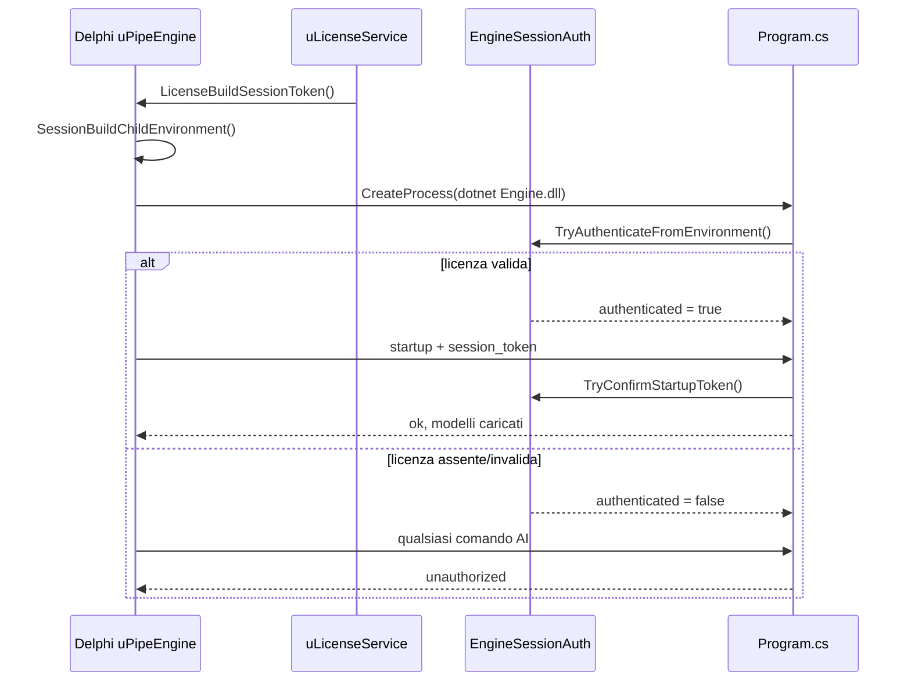

# Architettura SmartInterview

[← Torna al README](../README.md)

## Panoramica

SmartInterview è un copilota desktop per colloqui tecnici su Windows. L'applicazione cattura l'audio di sistema (e opzionalmente il microfono), lo trascrive localmente con **Whisper**, e genera risposte in streaming da un modello **Qwen2.5 GGUF** caricato in locale. Durante il colloquio **non** vengono usate API cloud.

Lo stack è ibrido Delphi + .NET:

| Componente | Tecnologia | Ruolo |
|------------|------------|-------|
| Interfaccia utente | Delphi 12 VCL (Win64) | Overlay, hotkey, tray, cattura audio WASAPI, licensing |
| Motore AI | `SmartInterview.Engine.dll` (.NET 10) | Whisper.net + LLamaSharp (llama.cpp) |
| Bridge | `uPipeEngine.pas` | Avvia processo `dotnet`, pipe stdin/stdout, protocollo JSON-lines |
| Gate licenza | `uSessionAuth` + `EngineSessionAuth` | Il motore accetta comandi solo con licenza valida |

```
┌──────────────────────────────────────────────────────────────────┐
│                 SmartInterview.exe (Delphi Win64)                 │
│  ┌──────────┐  ┌─────────────┐  ┌────────────────────────────┐  │
│  │ uMainForm│  │uAudioCapture│  │ uGlobalKeyboardHook        │  │
│  │ overlay  │  │ WASAPI 16kHz│  │ Ctrl/Shift/Alt hold        │  │
│  └────┬─────┘  └──────┬──────┘  └────────────────────────────┘  │
│       │               │ PCM float32                                │
│       ▼               ▼                                          │
│  ┌────────────────────────────────────────────────────────────┐  │
│  │ uLicenseService ──► uSessionAuth (token + env vars)        │  │
│  └──────────────────────────┬─────────────────────────────────┘  │
│                             │                                     │
│  ┌──────────────────────────▼─────────────────────────────────┐  │
│  │              uPipeEngine (CreateProcess + pipe)              │  │
│  └──────────────────────────┬─────────────────────────────────┘  │
└─────────────────────────────┼────────────────────────────────────┘
                              │ dotnet SmartInterview.Engine.dll
                              │ stdin/stdout JSON-lines
                              ▼
┌──────────────────────────────────────────────────────────────────┐
│           Processo host .NET (SmartInterview.Engine.dll)          │
│  ┌─────────────────────┐                                         │
│  │ EngineSessionAuth   │ ◄── gate: licenza + token + ora online  │
│  └──────────┬──────────┘                                         │
│             ▼                                                     │
│  ┌──────────────┐  ┌────────────────┐  ┌─────────────────┐     │
│  │ Transcriber  │  │ LocalLlmClient │  │ HardwareProbe   │     │
│  │ Whisper.net  │  │ LLamaSharp     │  │ CUDA/Vulkan/CPU │     │
│  └──────────────┘  └────────────────┘  └─────────────────┘     │
└──────────────────────────────────────────────────────────────────┘
```

> **Nota:** Delphi **non** carica la DLL in-process (nessun `LoadLibrary` / P/Invoke verso il motore). Il bridge avvia un **processo figlio** che esegue l'assembly .NET tramite il runtime `dotnet`, con comunicazione JSON su pipe standard.

## Progetti nel repository

| Progetto | Percorso | Scopo |
|----------|----------|-------|
| SmartInterview | `Projects/SmartInterview/` | Applicazione principale |
| LicenseManager | `Projects/LicenseManager/` | Tool interno per generare/gestire licenze |
| Engine | `Engine/` | Assembly C# motore AI |
| Common | `Common/` | Unità Pascal condivise |
| Group project | `Projects.groupproj` | Build di entrambi i progetti Delphi |

## Flusso di avvio

1. **Mutex single-instance** — una sola istanza dell'app (`SmartInterview.dpr`).
2. **Licenza** (`uFrmLicense` → `uLicenseService`) — verifica chiave + ora UTC online.
3. **Disclaimer** (`uFrmDisclaimer`) — accettazione obbligatoria (EULA v3).
4. **Setup colloquio** (`uFrmInterviewSetup`) — prompt opzionale profilo.
5. **Splash** (`uFrmSplash` → `uAppStartup.RunInitialStartup`):
   - `TPipeEngine.Start` avvia `dotnet SmartInterview.Engine.dll` da `Win64\<Config>\EngineDeploy\`.
   - Passa token sessione e credenziali licenza via variabili d'ambiente.
   - IPC `ping` → `startup`: download/caricamento modelli Whisper + LLM, warm-up, profilo.
6. **Main form** — riusa l'istanza `TPipeEngine` già avviata dallo splash (`TakeStartupEngine`).

## Gate licenza motore AI

La comunicazione con il motore è **bloccata** finché la licenza non è verificata. Il flusso è simmetrico tra Delphi e C#.

### Lato Delphi

1. `LicenseBuildSessionToken` (`uLicenseService`) richiede licenza valida in registry.
2. Costruisce token `SI_SESSION.v2.<expiry_unix>.<username_b64>.<hmac_b64>` (`uSessionAuth.pas`).
3. `TPipeEngine.Start` chiama `SessionBuildChildEnvironment` che imposta nel processo figlio:
   - `SMARTINTERVIEW_SESSION` — token HMAC
   - `SMARTINTERVIEW_LICENSE` — chiave licenza
   - `SMARTINTERVIEW_USER` — username forum normalizzato
4. Il comando `startup` include anche `session_token` nel JSON per conferma ridondante.

### Lato motore (`EngineSessionAuth.cs`)

All'avvio del processo:

1. `TryAuthenticateFromEnvironment` legge le tre variabili d'ambiente.
2. Valida: formato token, scadenza (24h), username corrispondente, **ora UTC online** (`OnlineTime.cs`), **chiave licenza v4** (`LicenseCodec.cs`), firma HMAC.
3. Se fallisce → `_authenticated = false` → tutti i comandi (eccetto `shutdown`) rispondono `{ "ok": false, "error": "unauthorized" }`.
4. Il comando `startup` richiede inoltre `session_token` nel payload e verifica corrispondenza con il token d'ambiente.

Build Debug dell'engine (`DIAGNOSTIC_LOG`) consente bypass diagnostico senza handshake licenza.



## Modalità di ascolto

### Manuale (tieni premuto Ctrl/Shift/Alt)

- Cattura audio finché il tasto è premuto (`uGlobalKeyboardHook`).
- Anteprima live ogni ~450 ms (trascrizione full-buffer).
- Al rilascio: trascrizione finale → risposta sempre generata.

### Automatica (VAD)

- `TVoiceSegmenter` (Delphi) segmenta l'audio di sistema per attività vocale.
- Anteprima live durante il segmento.
- A fine segmento: `classify_utterance` → salta non-domande/duplicati → streaming risposta (rispetta `[[SKIP]]` nel prompt LLM).

## Rilevamento hardware e backend GPU

`Engine/HardwareProbe.cs` rileva GPU NVIDIA (incluso Blackwell RTX 50xx) e VRAM da registry.

`Engine/NativeBackendBootstrap.cs` seleziona il backend llama.cpp:

| GPU | Ordine LLM |
|-----|------------|
| NVIDIA (non-Blackwell) | CUDA12 → Vulkan → CPU |
| NVIDIA Blackwell (RTX 50xx) | Vulkan → CPU |
| Altro | Vulkan → CPU |

Whisper usa backend analoghi via `WhisperBackendBootstrap.cs` (CUDA12/Vulkan/CPU).

## Modelli

I modelli **non** sono nel repository. Al primo avvio vengono scaricati in:

- `<exe>\models\`, oppure
- `%LOCALAPPDATA%\SmartInterview\models\`

Quando il motore gira da `EngineDeploy\`, `AppPaths.cs` risale alla cartella `models\` accanto a `SmartInterview.exe` per evitare download duplicati.

Cataloghi: `Engine/ModelCatalog.cs`, `Engine/WhisperModelCatalog.cs` (mirror Delphi in `uModelCat.pas`, `uWhisperCat.pas`).

| Tier | LLM | Whisper |
|------|-----|---------|
| Fast | Qwen2.5-3B Q4_K_M | ggml-small |
| Balanced | Qwen2.5-7B | ggml-medium |
| Max | Qwen2.5-14B | ggml-large-v3 |

## Impostazioni persistenti

Registry `HKCU\Software\SmartInterview` via `uRegistryStore.pas`: lingua, tier modelli, lunghezza risposta, tasto ascolto, opacità overlay, profilo colloquio (ruolo/stack/job/esperienza), parametri VAD.

## Documentazione correlata

- [Setup e build](setup.md)
- [Motore C# / DLL](csharp-dll.md)
- [Riferimento unità Pascal](pas-reference.md)
- [Sistema licenze](licensing.md)
