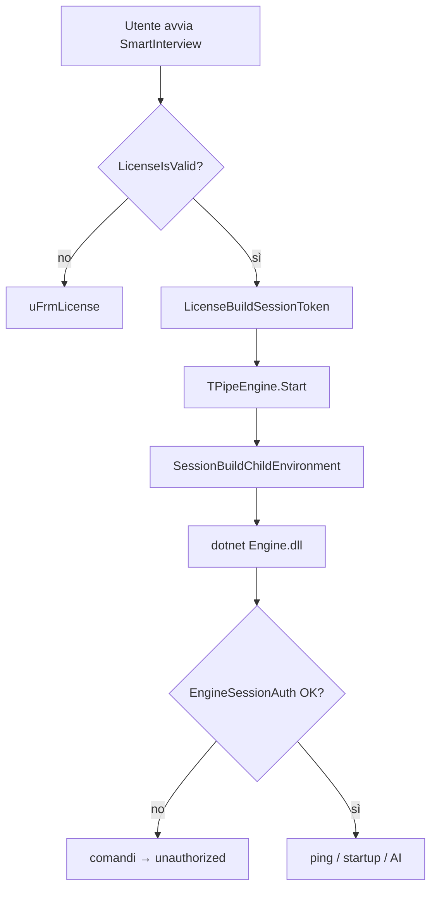

# Sistema licenze

[← Torna al README](../README.md) · [Guida sicurezza semplice](sicurezza-guida.md) · [Architettura](architecture.md)

## Panoramica

SmartInterview usa licenze offline embedded nella chiave. Le **nuove** licenze usano il formato **v5** (`SI5-…`, firma ECDSA P-256). Le chiavi **v4** legacy (32 caratteri senza prefisso) restano accettate. La scadenza si verifica con **ora UTC online** (anti-manomissione data di sistema).

La licenza valida è **prerequisito** per avviare il motore AI: senza autenticazione sessione, `SmartInterview.Engine.dll` rifiuta tutti i comandi.

## Componenti

| Componente | Percorso | Ruolo |
|------------|----------|-------|
| Codec v4/v5 | `Common/uLicenseCodec.pas` | Router decode/validate; v4 legacy |
| Codec v5 | `Common/uLicenseCodecV5.pas` | Payload SI5, verifica firma ECDSA |
| Firma ECDSA | `Common/uLicenseEcdsa.pas` | Verifica firma (chiave pubblica embedded) |
| Firma emissione | `LicenseManager/uLicenseEcdsaSign.pas` | Firma con chiave privata (solo LicenseManager) |
| Monitor periodico | `Common/uLicenseMonitor.pas` | Re-check 6h, grace offline 72h |
| Servizio app | `uLicenseService.pas` | Validazione, attivazione, anchor registry, token sessione |
| Ora online | `Common/uLicenseOnlineTime.pas` | Fetch UTC da worldtimeapi.org / timeapi.io |
| Sessione motore | `uSessionAuth.pas` | Token HMAC v2 + env vars processo figlio |
| Auth motore C# | `Engine/EngineSessionAuth.cs` | Gate licenza lato DLL |
| Codec motore C# | `Engine/LicenseCodec.cs`, `LicenseCodecV5.cs` | Validazione v4/v5 nel processo .NET |
| Fingerprint | `uMachineFingerprint.pas` | Codice richiesta attivazione (non usato nel token sessione) |
| Richiesta attivazione | `uActivationRequest.pas` | Codice `RQ1` per supporto venditori |
| Tool admin | `LicenseManager.exe` | Generazione e gestione licenze |

## Formato chiave v5 (corrente)

- Prefisso **`SI5-`**, 34 gruppi da 4 caratteri Base32 (~136 caratteri payload+firma)
- Payload 21 byte: magic `$55`, flags, scadenza (giorno UTC), **data emissione** (giorno UTC), username (max 10)
- Firma **ECDSA P-256** 64 byte sulla SHA-256 del payload
- Chiave **privata** solo in `Projects/LicenseManager/Keys/license_signing.priv` (generare con `dotnet run --project tools/KeyGen`)
- Chiave **pubblica** embedded in app ed engine (`uLicensePublicKey.pas`, `LicenseCodecV5.cs`)

## Formato chiave v4 (legacy)

- **32 caratteri** Base32 (alfabeto senza I/L/O/U), formattati come `XXXX-XXXX-XXXX-XXXX-XXXX-XXXX-XXXX-XXXX`
- Payload 20 byte: magic `$54`, flags (active/lifetime), expiry Unix day, username (max 10 char), HMAC tail
- Cifratura XOR con keystream derivato da HMAC
- Username normalizzato: lowercase, trim (`LicenseNormalizeUsername`)

### Flag

| Flag | Valore | Significato |
|------|--------|-------------|
| `LicenseFlagActive` | `$01` | Licenza attiva |
| `LicenseFlagLifetime` | `$02` | Senza scadenza |

## Flusso attivazione (SmartInterview)

1. Utente inserisce username forum + chiave in `uFrmLicense`.
2. `LicenseTryActivate` verifica:
   - Connessione internet (ora UTC via `TryFetchUtcNow`)
   - Decode payload v5 o v4 (`LicenseCodecTryDecodePayload`)
   - Firma ECDSA valida (v5) o HMAC (v4)
   - Username corrispondente, flag active, non scaduta
3. Chiave salvata in registry `HKCU\Software\SmartInterview`:
   - `LicenseKey` — chiave licenza
   - `LicenseForumUser` — username normalizzato

## Flusso gate motore AI



### Token sessione v2

Formato: `SI_SESSION.v2.<expiry_unix>.<username_b64url>.<hmac_b64url>`

- **Scadenza:** 24 ore (`SessionValiditySeconds = 86400`)
- **Payload HMAC:** `username|licenseKey|expiryUnix`
- **Secret HMAC:** `SmartInterview|EngineSession|v2|hmac` (identico in Delphi e C#)

Il token lega **username forum + chiave licenza**, non il fingerprint macchina.

### Validazione lato motore

`EngineSessionAuth.TryValidateToken` verifica in sequenza:

1. Formato token (5 parti, prefisso `SI_SESSION`, versione `v2`)
2. Scadenza token
3. Username nel token = `SMARTINTERVIEW_USER`
4. Ora UTC online (`OnlineTime.TryFetchUtcNow`)
5. Licenza v5/v4 valida (`LicenseCodec.TryValidate`)
6. Firma HMAC (confronto timing-safe)

## Fingerprint macchina (attivazione)

`uMachineFingerprint.pas` genera un codice richiesta da WMI (CPU, board, disk) + salt `SmartInterview|v1|machine`.

Usato da `uActivationRequest.pas` per codici supporto `RQ1` — **non** partecipa al gate sessione motore.

## Scadenza e riattivazione

Al riavvio, `LicenseIsValid` usa l'ora UTC online. Se la chiave è **scaduta** o **disattivata**:

1. `LicenseStoreClear` rimuove chiave e username dal registry
2. `TFrmLicense.EnsureLicensed` mostra di nuovo il form di attivazione
3. Serve una **nuova chiave** dal venditore (la scadenza è nel payload della chiave)

Senza connessione internet la validazione fallisce (messaggio offline) — non è possibile aggirare la scadenza modificando l'orologio di sistema.

## Controllo periodico (app aperta)

Con l'app in esecuzione:

- Ogni **30 minuti** viene valutato se serve un re-check (soglia effettiva **6 ore** dall'ultimo controllo).
- **Online:** verifica completa con ora UTC; se scaduta → stop engine, pulizia registry, form attivazione.
- **Offline:** stima UTC da ultimo ancoraggio online + tempo monotonic; fino a **72 ore** senza internet l'uso continua; oltre → engine fermato finché non torna la rete.

Non serve essere online ogni 24 ore se la licenza non è scaduta: serve un check online periodico per aggiornare l'ancoraggio e rilevare la scadenza reale.

## LicenseManager (tool interno)

Utility separata per venditori/admin:

- **Richiede internet** per creare licenze (`TryFetchUtcNow` prima di ogni emissione)
- Crea licenze con username, scadenza (o lifetime), flag active
- Preset rapidi: 1/3/6/12 mesi (basati sulla data UTC online, non sull'orologio locale)
- Salva elenco in `licenses.json` accanto all'exe
- Decode/visualizza payload chiavi esistenti

- Genera chiavi v5: `dotnet run --project tools/KeyGen` (prima volta o rotazione produzione)

Vedi [Guida sicurezza semplice](sicurezza-guida.md) e [Audit sicurezza](security-audit.md).

### Build

```text
Projects/LicenseManager/LicenseManager.dproj
Search path: ..\..\Common\
```

## Storage registry

Chiavi principali in `HKCU\Software\SmartInterview`:

| Valore | Unità | Descrizione |
|--------|-------|-------------|
| `LicenseKey` | `uLicenseService` | Chiave licenza attiva |
| `LicenseForumUser` | `uLicenseService` | Username forum |
| `LicenseAnchorUtc` | `uLicenseMonitor` | Ultimo UTC online verificato (HMAC-protected) |
| `LicenseAnchorHmac` | `uLicenseMonitor` | Integrità ancoraggio anti-manomissione registry |
| `EulaToken` | `uRegistryStore` | Hash accettazione disclaimer (v3) |

## Aggiungere unità condivise future

Mettere nuove unità in `Common/` e aggiornare `DCC_UnitSearchPath` in tutti i `.dproj` che le usano. Vedi [Setup → Common](setup.md#common--unità-pascal-condivise).
