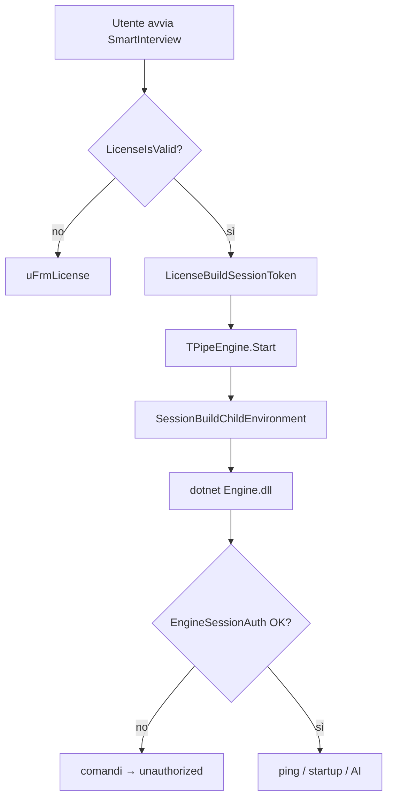

# Sistema licenze

[← Torna al README](../README.md) · [Architettura](architecture.md)

## Panoramica

SmartInterview usa licenze offline embedded nella chiave (formato **v4**), con verifica dell'ora di scadenza tramite **ora UTC online** (anti-manomissione data di sistema).

La licenza valida è **prerequisito** per avviare il motore AI: senza autenticazione sessione, `SmartInterview.Engine.dll` rifiuta tutti i comandi.

## Componenti

| Componente | Percorso | Ruolo |
|------------|----------|-------|
| Codec licenza | `Common/uLicenseCodec.pas` | Encode/decode chiavi 32 caratteri Base32 (8 gruppi × 4) |
| Servizio app | `uLicenseService.pas` | Validazione, attivazione, storage registry, build token sessione |
| Ora online | `uLicenseOnlineTime.pas` | Fetch UTC da worldtimeapi.org / timeapi.io |
| Sessione motore | `uSessionAuth.pas` | Token HMAC v2 + variabili d'ambiente processo figlio |
| Auth motore C# | `Engine/EngineSessionAuth.cs` | Validazione simmetrica lato DLL |
| Codec motore C# | `Engine/LicenseCodec.cs` | Mirror validazione licenza nel processo .NET |
| Fingerprint | `uMachineFingerprint.pas` | Codice richiesta attivazione (non usato nel token sessione) |
| Richiesta attivazione | `uActivationRequest.pas` | Codice `RQ1` per supporto venditori |
| Tool admin | `LicenseManager.exe` | Generazione e gestione licenze |

## Formato chiave v4

- **32 caratteri** Base32 (alfabeto senza I/L/O/U), formattati come `XXXX-XXXX-XXXX-XXXX-XXXX-XXXX-XXXX-XXXX`
- Payload 20 byte: magic `$54`, flags (active/lifetime), expiry Unix day, username (max 10 char), HMAC tail
- Cifratura XOR con keystream derivato da HMAC
- Username normalizzato: lowercase, trim (`LicenseNormalizeUsername`)

### Flag

| Flag | Valore | Significato |
|------|--------|-------------|
| `LicenseFlagActive` | `$01` | Licenza attiva |
| `LicenseFlagLifetime` | `$02` | Senza scadenza |

## Flusso attivazione (SmartInterview)

1. Utente inserisce username forum + chiave in `uFrmLicense`.
2. `LicenseTryActivate` verifica:
   - Connessione internet (per ora UTC via `TryFetchUtcNow`)
   - Decode payload (`LicenseCodecTryDecodePayload`)
   - Username corrispondente
   - Flag active, non scaduta
   - Round-trip encode (integrità)
3. Chiave salvata in registry `HKCU\Software\SmartInterview`:
   - `LicenseKey` — chiave licenza
   - `LicenseForumUser` — username normalizzato

## Flusso gate motore AI



### Token sessione v2

Formato: `SI_SESSION.v2.<expiry_unix>.<username_b64url>.<hmac_b64url>`

- **Scadenza:** 24 ore (`SessionValiditySeconds = 86400`)
- **Payload HMAC:** `username|licenseKey|expiryUnix`
- **Secret HMAC:** `SmartInterview|EngineSession|v2|hmac` (identico in Delphi e C#)

Il token lega **username forum + chiave licenza**, non il fingerprint macchina.

### Validazione lato motore

`EngineSessionAuth.TryValidateToken` verifica in sequenza:

1. Formato token (5 parti, prefisso `SI_SESSION`, versione `v2`)
2. Scadenza token
3. Username nel token = `SMARTINTERVIEW_USER`
4. Ora UTC online (`OnlineTime.TryFetchUtcNow`)
5. Licenza v4 valida (`LicenseCodec.TryValidate`)
6. Firma HMAC (confronto timing-safe)

## Fingerprint macchina (attivazione)

`uMachineFingerprint.pas` genera un codice richiesta da WMI (CPU, board, disk) + salt `SmartInterview|v1|machine`.

Usato da `uActivationRequest.pas` per codici supporto `RQ1` — **non** partecipa al gate sessione motore.

## LicenseManager (tool interno)

Utility separata per venditori/admin:

- Crea licenze con username, scadenza (o lifetime), flag active
- Preset rapidi: 1/3/6/12 mesi
- Salva elenco in `licenses.json` accanto all'exe
- Decode/visualizza payload chiavi esistenti

### Build

```text
Projects/LicenseManager/LicenseManager.dproj
Search path: ..\..\Common\
```

## Storage registry

Chiavi principali in `HKCU\Software\SmartInterview`:

| Valore | Unità | Descrizione |
|--------|-------|-------------|
| `LicenseKey` | `uLicenseService` | Chiave licenza attiva |
| `LicenseForumUser` | `uLicenseService` | Username forum |
| `EulaToken` | `uRegistryStore` | Hash accettazione disclaimer (v3) |

## Aggiungere unità condivise future

Mettere nuove unità in `Common/` e aggiornare `DCC_UnitSearchPath` in tutti i `.dproj` che le usano. Vedi [Setup → Common](setup.md#common--unità-pascal-condivise).
